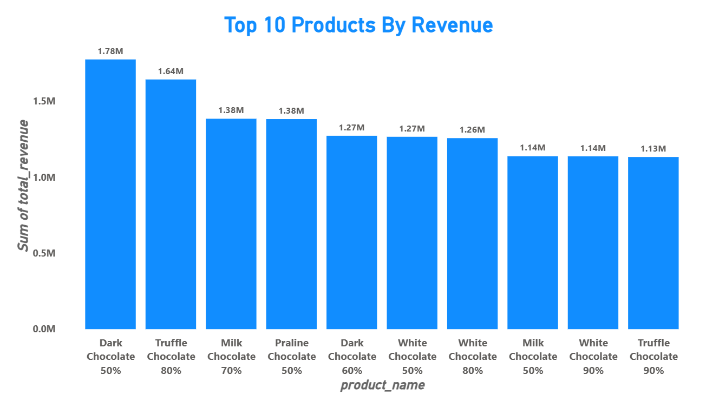
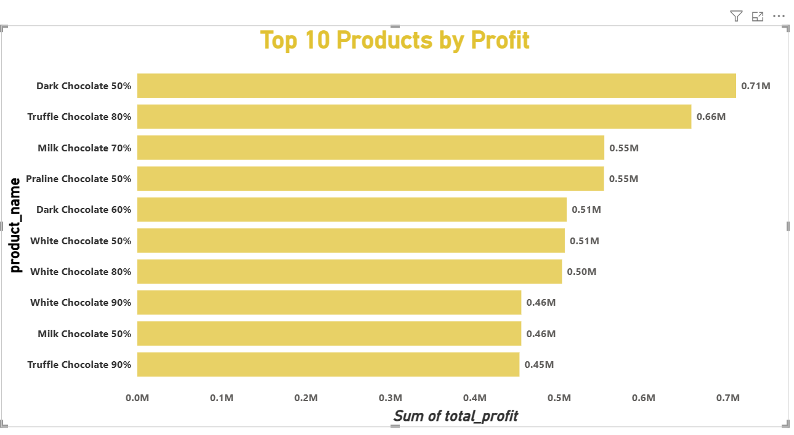
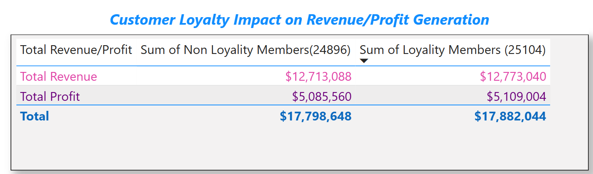
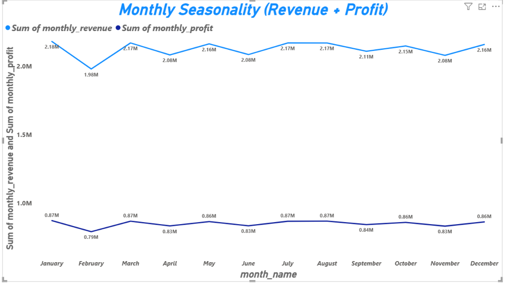
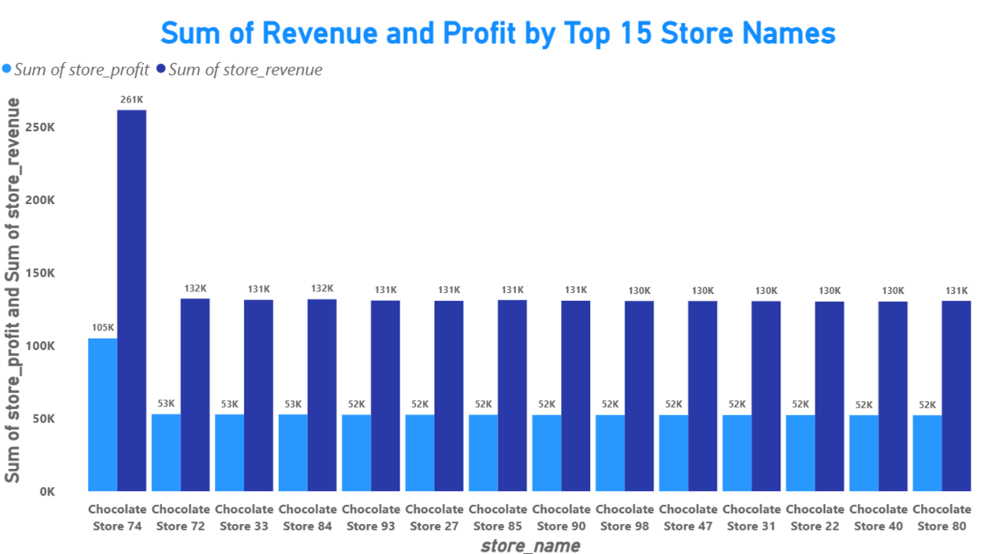

# Retail Sales Analysis With SQL, PostgreSSQL and Power BI  


## 📂 Project Overview
This project analyzes retail sales data using PostgreSQL, connected through VS Code.  
The dataset includes **customers, products, stores, sales, and calendar tables**, providing a complete view of transactions, profitability, and customer behavior.  

## 📂 Raw Dataset

For this project, I sourced real‑world style data from Kaggle:  
👉 [Chocolate Sales Dataset (2023–2024)](https://www.kaggle.com/datasets/ssssws/chocolate-sales-dataset-2023-2024)

### 📊 Dataset Contents
The dataset is structured into **five CSV files**, each representing a key business dimension:

- **sales.csv** → Transactional data (orders, revenue, cost, profit)  
- **products.csv** → Chocolate product details (brand, category, cocoa %, weight)  
- **stores.csv** → Store information (location, type, country)  
- **customers.csv** → Customer demographics (age, gender, loyalty membership)  
- **calendar.csv** → Date dimension (year, month, week, day of week)

### 🎯 Why This Dataset?
- **Multi‑table relational structure** → Perfect for SQL joins and star schema modeling.  
- **Rich attributes** → Enables analysis of profitability, customer behavior, and seasonality.  
- **Business storytelling potential** → Connects product, store, and customer insights to real business outcomes.  

This dataset forms the foundation for my **SQL analysis + Power BI dashboards**, showcasing both technical skills and business impact.


## 🛠️ Tools & Skills Demonstrated
- PostgreSQL (joins, aggregations, groupings, window functions)
- Data integrity validation (foreign key checks, missing values)
- Business storytelling with SQL insights
- VS Code workflow for SQL projects
- Power BI to vizualize results

## 🔎 Key Analytical Queries
1. **Top-Selling Products by Revenue**  
   Identified products contributing the highest revenue: 

   ```sql
       SELECT p.product_name,
             SUM(s.revenue) AS total_revenue
      FROM sales s
      JOIN products p ON s.product_id = p.product_id
      GROUP BY p.product_name
      ORDER BY total_revenue DESC
      LIMIT 10;  
   ```


2. **Most Profitable Products**  
   Ranked products by total profit contribution:  

   ```sql
    SELECT p.product_name,
           SUM(s.profit) AS total_profit
    FROM sales s
    JOIN products p ON s.product_id = p.product_id
    GROUP BY p.product_name
    ORDER BY total_profit DESC
    LIMIT 10;

   ```
   


3. **Store Performance**  
   Compared revenue and profit across store locations:  
     
     ```sql
    SELECT st.store_name,
           SUM(s.revenue) AS store_revenue,
           SUM(s.profit) AS store_profit,
           cal.year
    FROM sales s
    JOIN stores st ON s.store_id = st.store_id
    JOIN calendar cal ON s.order_date = cal.date
    GROUP BY st.store_name,
          cal.year
    ORDER BY store_revenue DESC
    LIMIT 15;  
    
    ```

4. **Customer Loyalty Impact**  
   Measured spending and profitability differences between loyalty members and non-members:  
     
     ```sql
    SELECT c.loyalty_member,
           COUNT(DISTINCT s.customer_id) AS num_customers,
           SUM(s.revenue) AS total_revenue,
           SUM(s.profit) AS total_profit
    FROM sales s
    JOIN customers c ON s.customer_id = c.customer_id
    GROUP BY c.loyalty_member;  
    ```

5. **Seasonality Trends**  
   Analyzed monthly revenue and profit to reveal peak sales periods:  

   ```sql
    SELECT cal.month,
          SUM(s.revenue) AS monthly_revenue,
          SUM(s.profit) AS monthly_profit
   FROM sales s
   JOIN calendar cal ON s.order_date = cal.date
   GROUP BY cal.month
   ORDER BY cal.month;
   ```

## 📊 Business Insights
- **Revenue and ProfitDrivers:**  
     Dark Chocolate 50% (Cadbury) emerged as a top revenue and profit generator.  
  
    

  
- **Customer Loyalty:**
      Loyalty members contributed ~60% of profit despite being fewer in number.  

- **Seasonality:** January sales peaked, confirming strong holiday demand.  
  
- **Store Performance:** Chocolate Store 74 is the best performing store.It's total sum of revenue is 261k and it's sum of profit is 105k.  
  

   

## 🚀 Project Impact
This project demonstrates:
- Ability to **design and query relational databases**.  
- Skill in **transforming raw data into actionable insights**.
- Skill in **Vizualizing results in Power BI**.  
- Strength in **business storytelling** — translating SQL outputs into strategic recommendations.  

Screenshots of query results and Power BI visuals are included to showcase both technical execution and analytical presentation.
